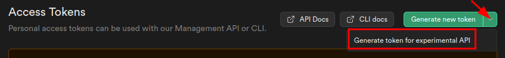

# Pulumi Supabase

A native pulumi provider for the Supabase Management API.

## Installing

To install this plugin run:

```bash
pulumi plugin install resource supabase ${VERSION} --server https://github.com/nitrictech/pulumi-supabase/releases/download/${VERSION} 
```
> Where `${VERSION}` is a tagged released of this resource see: [Releases](https://github.com/nitrictech/pulumi-supabase/releases)

### Using NPM

```bash
npm install @nitric/pulumi-supabase
```

### Using Golang

```bash
go get github.com/nitrictech/pulumi-supabase/sdk
```

## Configuring

This provider mostly uses the supabase experimental management API so an experimental access token will be required to deploy resources

When generating the token make sure to select an experimental token:



The provider can be configured by providing the following environment variable:

```bash
SUPABASE_ACCESS_TOKEN=<YOUR_ACCESS_TOKEN>
```

## Supported Resources

 - [x] Organizations
 - [x] Projects
 - [x] Buckets
 - [x] Secrets
 - [x] Database Functions

> Additional resource support is planned but if there is anything you'd like to see sooner, let us know in the issues

## Supported Languages

 - [x] Typescript
 - [x] Golang
 - [ ] C# (Generated but not published)
 - [ ] Python (Generated but not published)

> If you would like support for a missing language please raise an issue


## Examples

For example implementations see [here](./examples/)

## Development

### Prerequisites

Ensure the following tools are installed and present in your `$PATH`:

* [`pulumictl`](https://github.com/pulumi/pulumictl#installation)
* [Go 1.17](https://golang.org/dl/) or 1.latest
* [NodeJS](https://nodejs.org/en/) 14.x.  We recommend using [nvm](https://github.com/nvm-sh/nvm) to manage NodeJS installations.
* [Yarn](https://yarnpkg.com/)
* [TypeScript](https://www.typescriptlang.org/)
* [Python](https://www.python.org/downloads/) (called as `python3`).  For recent versions of MacOS, the system-installed version is fine.
* [.NET](https://dotnet.microsoft.com/download)

#### Build the provider and install the plugin

   ```bash
   $ make build install
   ```
   
This will:

1. Create the SDK codegen binary and place it in a `./bin` folder (gitignored)
2. Create the provider binary and place it in the `./bin` folder (gitignored)
3. Generate the dotnet, Go, Node, and Python SDKs and place them in the `./sdk` folder
4. Install the provider on your machine.

#### Test against the example
   
```bash
$ cd examples/simple
$ yarn link @pulumi/supabase
$ yarn install
$ pulumi stack init test
$ pulumi up
```
